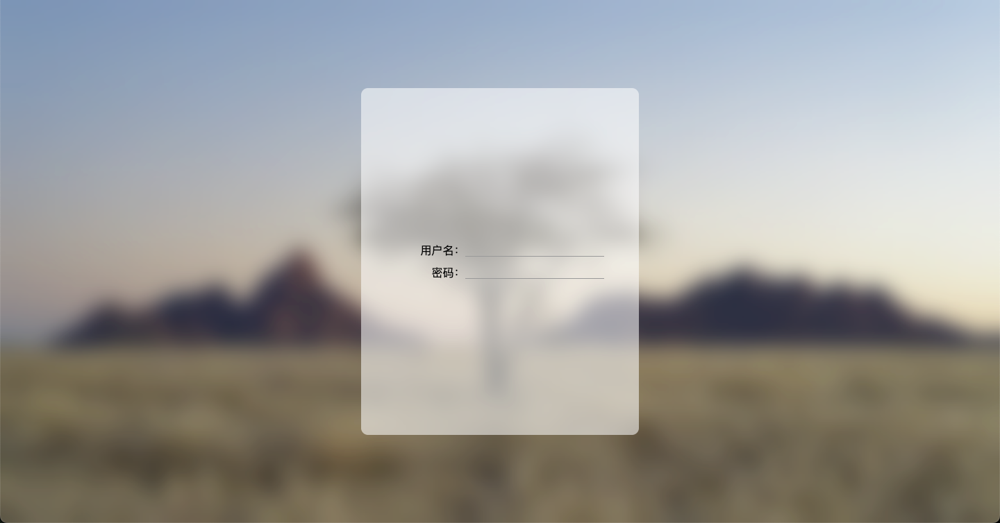

*# 通过backdrop-filter属性实现磨砂玻璃效果

先看看效果图：



可以看到背景和登录背景有明显的磨砂玻璃效果。

## 代码实现

:::code-group

```html [index.html]
<!DOCTYPE html>
<html lang="en">
  <head>
    <title>Learn about css property 'backdrop-filter'</title>
    <meta charset="UTF-8" />
    <meta name="viewport" content="width=device-width" />
    <link rel="stylesheet" href="styles.css" />
  </head>
  <body>
    <div id="app">
      <div class="container">
        <div id="loginForm">
          <div class="form-item">
            <label class="form-item-label" for="username">用户名：</label>
            <input class="form-item-blank form-item-input" type="text" name="username" />
          </div>
          <div class="form-item">
            <label class="form-item-label" for="password">密码：</label>
            <input class="form-item-blank form-item-input" type="password" name="password" />
          </div>
        </div>
      </div>
    </div>
  </body>
</html>
```

```css [styles.css]{28-29,53-54}
* {
  box-sizing: border-box;
}

html,
body {
  margin: 0;
  padding: 0;
  width: 100%;
  height: 100%;
  font-family: system-ui, sans-serif;
  color: black;
  background-color: white;
}

#app {
  width: 100%;
  height: 100%;
  background-image: url(xxx.jpg); /* 替换为你的背景图片路径 */
  background-size: cover;
  background-repeat: no-repeat;
  background-position: center;
}

.container {
  width: 100%;
  height: 100%;
  background-color: rgba(255, 255, 255, 0.1);
  backdrop-filter: blur(3px);
  display: flex;
  flex-direction: row;
  flex-wrap: nowrap;
  justify-content: center;
  align-items: center;
  animation: breath 5s ease-in-out alternate infinite;
}

@keyframes breath {
  0% {
    backdrop-filter: blur(3px);
  }
  50% {
    backdrop-filter: blur(15px);
  }
  100% {
    backdrop-filter: blur(3px);
  }
}

#loginForm {
  width: 400px;
  height: 500px;
  background-color: rgba(255, 255, 255, 0.5);
  backdrop-filter: blur(5px);
  border-radius: 10px;
  display: flex;
  flex-flow: column nowrap;
  justify-content: center;
  align-items: center;
}

.form-item {
  display: flex;
  flex-flow: row nowrap;
  align-items: center;
}

.form-item + .form-item {
  margin-top: 10px;
}

.form-item-label {
  display: block;
  width: 100px;
  text-align: right;
}

.form-item-blank {
  width: 200px;
}

.form-item-input {
  border: none;
  background-color: transparent;
  border-bottom: 1px solid #999;
}

.form-item-input:focus {
  outline: none;
}
```

:::

### 知识点讲解

#### `backdrop-filter` 属性

实现磨砂玻璃效果的关键在于使用 `backdrop-filter` 属性。它允许我们对元素**下面**的内容应用图形效果，如模糊或颜色偏移。 `backdrop-filter` 属性支持以下几种效果：

- `blur(px)`：模糊效果，`px` 是模糊的半径。
- `brightness(%)`：亮度调整，`%` 是相对于原始亮度的百分比。
- `contrast(%)`：对比度调整，`%` 是相对于原始对比度的百分比。
- `grayscale(%)`：灰度效果，`%` 是灰度的百分比。
- `sepia(%)`：棕褐色效果，`%` 是棕褐色的百分比。
- `saturate(%)`：饱和度调整，`%` 是相对于原始饱和度的百分比。
- `invert(%)`：反转颜色，`%` 是反转的百分比。
- `hue-rotate(deg)`：色相旋转，`deg` 是旋转的角度。
- `opacity(%)`：透明度调整，`%` 是相对于原始透明度的百分比。
- `drop-shadow(offsetX offsetY blurRadius color)`：添加阴影效果。
- `url()`：应用 SVG 滤镜。
- `revert`：将属性重置为其继承值或初始值，取决于上下文。

具体的值我们可以在 [MDN Web Docs](https://developer.mozilla.org/zh-CN/docs/Web/CSS/backdrop-filter) 中查看。我们这里只需要知道以下几点：

1. `backdrop-filter` 是对当前元素下方的元素产生效果，而不是对当前元素本身。
2. `backdrop-filter` + `blur(px)` 可以实现磨砂玻璃效果。

#### 为什么代码中要添加 `background-color` ？

在代码中，我们为 `.container` 和 `#loginForm` 添加了 `background-color` 属性，并设置了透明度。这是因为 `backdrop-filter` 是对当前元素下方的元素产生效果，而不是对当前元素本身。如果没有设置带透明度的背景色，下方的元素会被完全遮挡。

## 总结

本篇介绍了如何通过 CSS 的 `backdrop-filter` 属性实现磨砂玻璃效果。主要思路是在需要磨砂效果的元素上设置带透明度的 `background-color`，并结合 `backdrop-filter: blur()` 实现对下方内容的模糊处理。实际开发中，需注意 `backdrop-filter` 只作用于元素下方的内容，且需为目标元素设置透明背景色以展现出磨砂效果。该属性兼容性较新，部分浏览器可能需要加前缀或注意兼容性问题。
