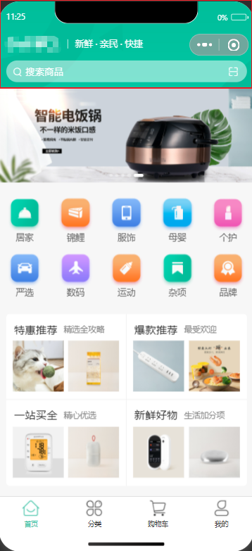
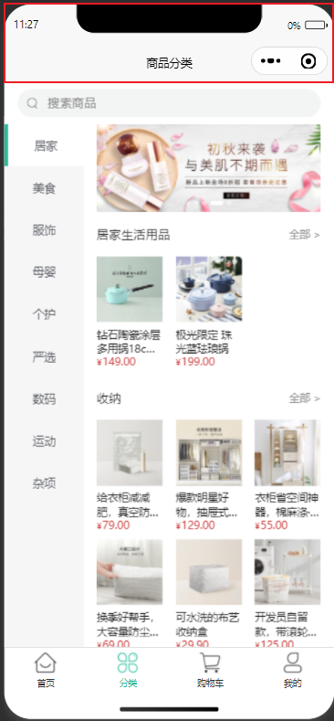

# 自定义导航栏

uni-app 有自带的导航栏，只需要配置 pages.json 即可配置导航栏背景色、标题文字、标题颜色等等

但有时候，内置的配置不满足开发需求，这时候就需要自定义导航栏

## 什么是自定义导航栏？





## 如何自定义导航栏？

### 设置 pages.json

想要自定义导航栏生效，需要设置 pages.json；

```json {6}
{
  "pages": [
    {
      "path": "pages/my/my",
      "style": {
        "navigationStyle": "custom",
      }
    },
  ]
}
```

### 开发导航栏

这一步省略，按照各自的设计稿开发导航栏即可

另外可以将开发的导航栏抽离成组件，这样下次再需要自定义导航栏的场景就不需要重复开发

这里提供一个示例代码：

```vue [custom-navigation-bar.vue]
<template>
  <view class="custom-navigation-bar">
    <view class="custom-navigation-bar__head">
      <image class="custom-navigation-bar__logo" src="@/static/image/logo.png" mode="heightFix" />
      <text class="custom-navigation-bar__title">新鲜&nbsp;·&nbsp;亲民&nbsp;·&nbsp;快捷</text>
    </view>
    <view class="search-box">
      <view class="search-box__container">
        <view>
          <text class="icon-search"></text>
          <text class="search-box__text">搜索商品</text>
        </view>
        <text class="icon-scan"></text>
      </view>
    </view>
  </view>
</template>

<script lang="ts" setup>
</script>

<style lang="scss" scoped>
.custom-navigation-bar {
  overflow: hidden;
  color: #fff;
  background-image: url("@/static/image/navigator_bg.png");
  background-repeat: no-repeat;
  background-size: cover;
  &__head {
    display: flex;
    align-items: center;
    height: 64rpx;
    padding-top: 6rpx;
    padding-left: 10px;
  }
  &__logo {
    width: 166rpx;
    height: 39rpx;
  }
  &__title {
    padding-left: 20rpx;
    margin-left: 20rpx;
    font-size: 26rpx;
    line-height: 28rpx;
    border-left: 1rpx solid #fff;
  }
  .search-box {
    box-sizing: border-box;
    width: 100%;
    height: 64rpx;
    padding: 0 20rpx;
    margin: 16rpx 0;
    font-size: 28rpx;
    &__container {
      box-sizing: border-box;
      display: flex;
      align-items: center;
      justify-content: space-between;
      width: 100%;
      height: 100%;
      padding: 0 24rpx 0 20rpx;
      background-color: rgba(255, 255, 255, 0.5);
      border-radius: 32rpx;
    }

    &__text {
      margin-left: 10rpx;
    }
    .icon-scan {
      font-size: 30rpx;
      // padding: 15rpx;
    }
  }
}
</style>

```

### 使用自定义导航栏

使用自定义导航栏也不用多说，按照 vue 项目使用组件的方式使用即可

#### 适配
