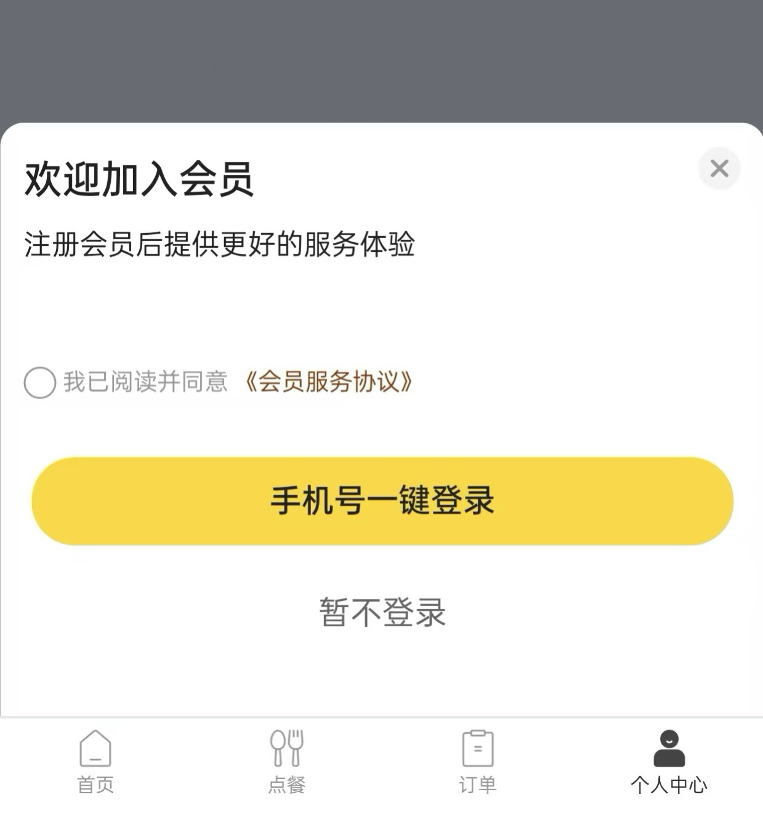
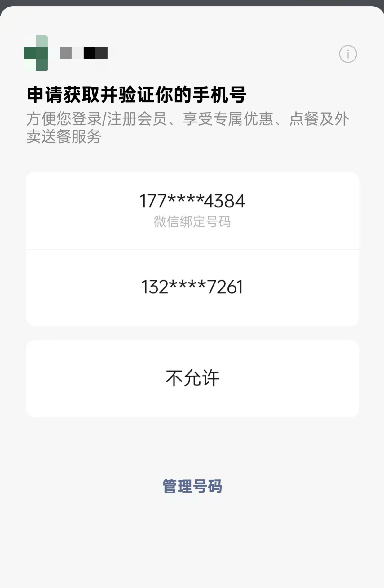
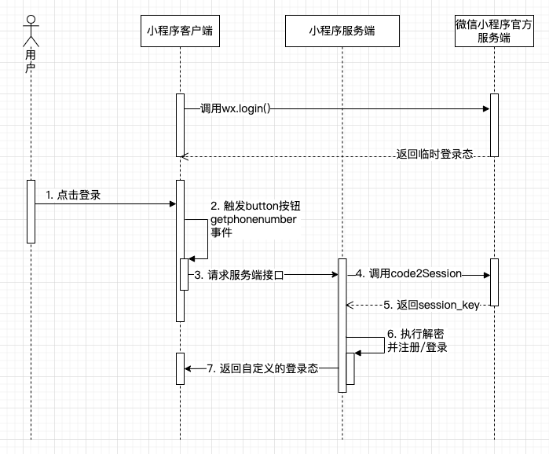

# 登录

登录是一个 app 常见但核心的功能，同时它也和用户系统息息相关，如果没有捋清楚登录的逻辑，那估计也无法掌握用户系统的逻辑。

在只需要处理 PC/H5 的场景下，一般会通过账密、扫码、第三方登录等方式进行登录；
但是在移动端场景里，除了账密、第三方登录之外，还能够使用本机手机号一键登录，在微信小程序还可以结合微信账号进行登录...

以上种种，都说明登录功能在移动端实现起来不简单，所以十分有必要花点时间弄清楚各个环境下要如何实现登录功能

:::info 需要实现登录的环境

- 微信小程序
- iOS & Android 手机号一键登录
- iOS Apple 登录

:::

## 微信登录

微信登录一般会通过**手机号**进行登录。

### 通过手机号登录

::: warning 注意

手机号的获取需要通过内置组件`button`的`open-type`来获取，这个需要花钱，详情看[官方文档](https://developers.weixin.qq.com/miniprogram/dev/framework/open-ability/getPhoneNumber.html)

:::

#### 最终效果





#### 流程讲解



- 进入登录页面需要先通过`wx.login`获取临时登录态`code`，前端保存到变量`tempCode`
- 点击**登录**按钮
- 触发组件`button`的点击事件`getphonenumber`的回调事件
- 接收`getphonenumber`回调事件的参数`encryptedData`和`iv`
  - `encryptedData`是加密后的数据
  - `iv`是加密算法
  - 这两者都是给*服务端*使用的，前端不用管
- 请求小程序自己的的服务端接口
- 服务端通过临时登录态`tempCode`、`appid`及`secret`换取`session_key`和`openid`
  - 通过请求微信官方接口`code2Session`，点击查看[详情](https://developers.weixin.qq.com/miniprogram/dev/OpenApiDoc/user-login/code2Session.html)
- 拿到`session_key`和`openid`之后就可以在服务端自行解密了，如何解密看[这里](https://developers.weixin.qq.com/miniprogram/dev/framework/open-ability/signature.html)
- 解密之后可以得到完整的手机号，服务端可以拿手机号执行注册/登录流程，完成之后返回自定义登录态给客户端

#### 代码实现

```vue{3-4,15-19,23-31}
<template>
 <button
  open-type="getPhoneNumber"
  @getphonenumber="loginByPhone"
  class="login__button--phone"
  hover-class="none">
  手机号快捷登录
 </button>
</template>
<script lang="ts" setup>
import { apiLoginByWeiXin } from "@/services/login";
// 临时登录码
let tempCode = "";
onLoad(() => {
  wx.login({
    success(res) {
      tempCode = res.code;
    },
  });
});
const userStore = useUserStore();
// 手机号登录
const loginByPhone = async (e) => {
  if (e.detail.errMsg !== "getPhoneNumber:ok") return;
  const res = await apiLoginByWeiXin({
    code: tempCode,
    encryptedData: e.detail.encryptedData!,
    iv: e.detail.iv!,
  });
  loginSuccess(res.result);
};

// 登录成功回调函数
const loginSuccess = (userInfo) => {
  userStore.saveUserInfo(userInfo);
  uni.showToast({
    title: "登录成功",
    icon: "success",
  });
  const timer = setTimeout(() => {
    clearTimeout(timer);
    uni.switchTab({
      url: "/pages/my/my",
    });
  }, 500);
};
</script>
```

::: details 新版获取手机号的方式

上面的方式是旧版的获取手机号的方式，从基础库 2.21.2 开始可以使用更简单的方式获取到手机号，不需要客户端提前调用`wx.login`，服务端也不需要自行解密，更多内容可以看[官方文档](https://developers.weixin.qq.com/miniprogram/dev/framework/open-ability/getPhoneNumber.html)

:::
