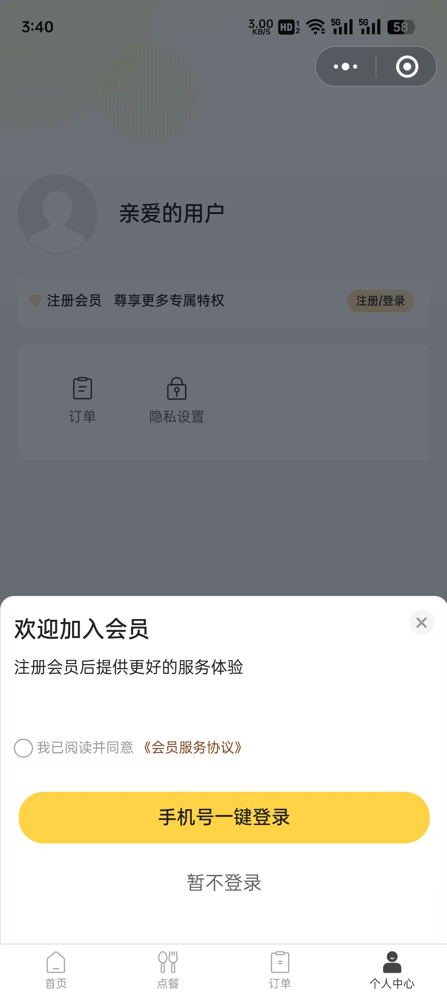

# 登录

登录是一个 app 常见但核心的功能，同时它也和用户系统息息相关，如果没有捋清楚登录的逻辑，那估计也无法掌握用户系统的逻辑。

在只需要处理 PC/H5 的场景下，一般会通过账密、扫码、第三方登录等方式进行登录；
但是在移动端场景里，除了账密、第三方登录之外，还能够使用本机手机号一键登录，在微信小程序还可以结合微信账号进行登录...

以上种种，都说明登录功能在移动端实现起来不简单，所以十分有必要花点时间弄清楚各个环境下要如何实现登录功能

:::info 需要实现登录的环境

- 微信小程序
- iOS & Android 手机号一键登录
- iOS Apple 登录

:::

## 微信登录

微信登录一般会通过**手机号登录**或者**微信 token 登录** 2 种方式进行登录。

### 手机号登录

<!--  -->

微信上的手机号一键登录

### 微信 token 登录
