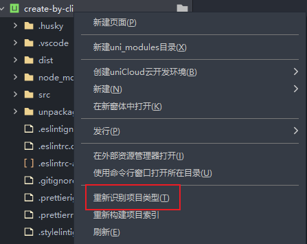

# App预览&打包

:::warning 注意

APP 相关的操作都需要在 HBuilderX 中进行。不论你是用 `HBuilder` 创建的项目还是通过 `vue-cli` 创建的项目，如果需要预览或打包成 APP，都需要在 HBuilderX 中进行。

:::

## 预览

### Android 预览

1. 在 `HBuilderX` 中打开项目
2. 在 `HBuilderX` 中的 **文档结构图** 中选中你的项目
3. 点击右上角的 **运行** 菜单
4. 在弹出的菜单中选择 **运行到手机或模拟器** -> **运行到 Android App 基座**
5. 选择你的设备
6. 点击 **运行** 按钮

:::details 为什么我的项目没有 **运行到手机或模拟器** 选项？

如果是通过 `vue-cli` 创建的项目，导入到 `HBuilderX` 后，需要先在 `HBuilderX` 中选中项目，然后右键点击 **重新识别项目类型** 即可

注意，只有 `uni-app` 、`5+app` 、 `wap2app` 可以真机运行

:::

:::details 为什么我的项目没有 **运行到 Android App 基座** 选项？

需要先选中项目，才能看到 **运行到 Android App 基座** 选项。

:::

## 打包

### Android 打包
