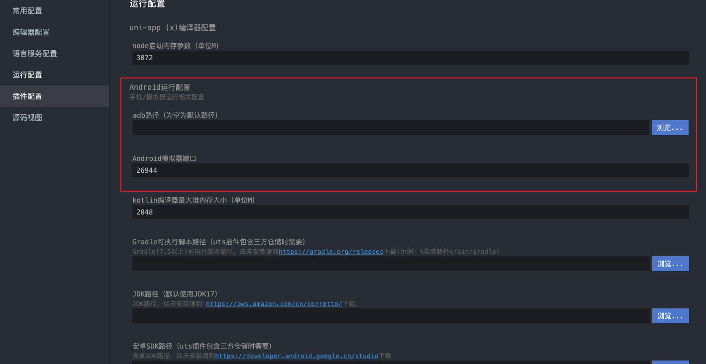

# App预览&打包

:::warning 注意

APP 相关的操作都需要在 `HBuilderX` 中进行。不论你是用 `HBuilderX` 创建的项目还是通过 `vue-cli` 创建的项目，如果需要预览或打包成 APP，都需要在 `HBuilderX` 中进行。

:::

## 预览

### Android 预览

1. 在 `HBuilderX` 中打开项目
2. 在 `HBuilderX` 中的 **文档结构图** 中选中你的项目
3. 点击右上角的 **运行** 菜单
4. 在弹出的菜单中选择 **运行到手机或模拟器** -> **运行到 Android App 基座**
5. 选择你的设备
6. 点击 **运行** 按钮

#### 注意事项

- 确保你的手机已经连接到电脑，并且已经开启了 **USB 调试模式**。
  - 具体如何开启 USB 调试模式，不同手机品牌和型号可能有所不同，可以在网上找下自己的手机对应型号的开启方法。
- 首次运行会需要安装插件 `App 真机运行`，直接安装即可。

:::details 为什么我的项目没有 **运行到手机或模拟器** 选项？

如果是通过 `vue-cli` 创建的项目，导入到 `HBuilderX` 后，需要先在 `HBuilderX` 中选中项目，然后右键点击 **重新识别项目类型** 即可

注意，只有 `uni-app` 、`5+app` 、 `wap2app` 可以真机运行

:::

:::details 为什么我的项目没有 **运行到 Android App 基座** 选项？

需要先选中项目，才能看到 **运行到 Android App 基座** 选项。

:::

#### 如何运行到模拟器？

具体的运行方式其实和运行到手机差不多，只是在选择设备的时候需要选择模拟器对应的设备。

在运行到模拟器之前，需要先运行模拟器。同时确保模拟器开放的端口和 `HBuilderX` 中配置的端口一致。

:::info 端口

- 夜神模拟器 端口号：**62001**
- 海马玩模拟器 端口号：**26944**
- 网易mumu模拟器端口号：**7555**
- 天天模拟器 端口号：**6555**

:::

`adb 路径` 可以选择配置，也可以不配置，只要运行的时候能在设备列表里面看到你的模拟器设备即可。

:::info adb 路径

- mac `HBuilderX` adb 路径：**/Applications/HBuilderX.app/Contents/HBuilderX/plugins/launcher-tools/tools/adbs/** 下

:::

## 打包

### Android 打包
