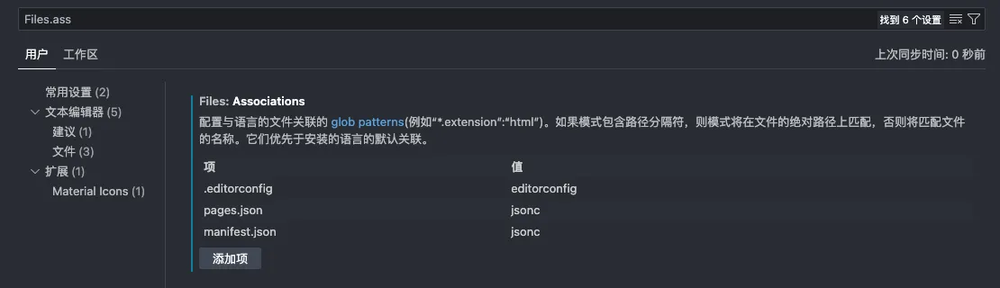
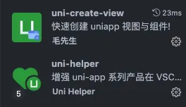
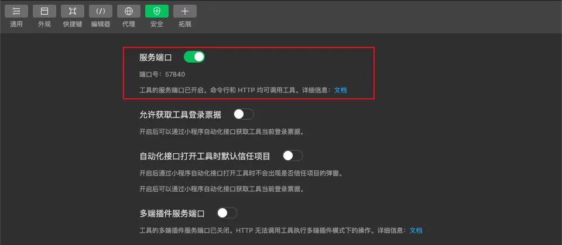
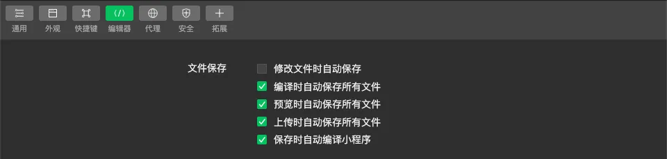
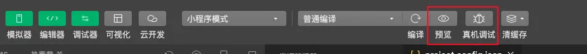
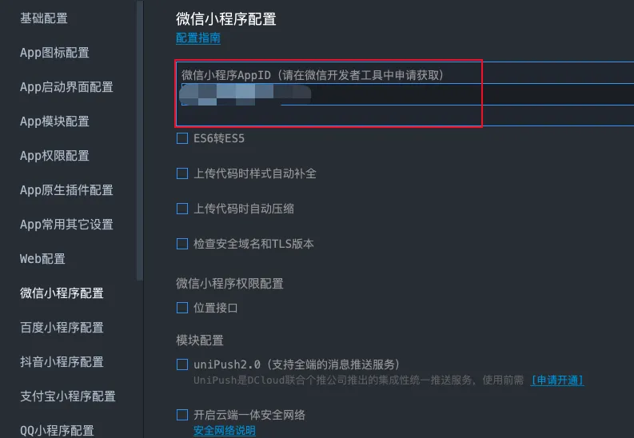

# 开发环境配置

## 一、使用 VS Code 开发时的配置

:::info

如果使用 HBuilder 创建项目不需要额外配置，直接按官方文档就行

:::

:::info

这个配置只适用于 Vue3+TS 版本，Vue2 版本需要找其他资料

:::

:::warning 注意

使用 VS Code 运行的时候需要手动打开微信开发者工具，然后导入<u>dist/dev/mp-weixin</u>项目，之后正常开发即可

:::

### 创建项目

看[uni-app官网](https://uniapp.dcloud.net.cn/quickstart-cli.html)文档

### 允许个别 json 文件写注释

配置 `manifest.json` 和 `pages.json` 文件可以写注释



### 配置代码提示



`uni-helper` 包含有多个拓展，都是关于 `uni-app` 的，可以直接下载。

`uni-create-view` 用于快捷创建页面、组件、分包页面

### 配置 TS 检查

<u>依赖下载</u>

```shell
# uni-app 类型提示
pnpm add -D @uni-helper/uni-types
# 微信相关api提示
pnpm add -D @types/wechat-miniprogram
```

<u>配置 tsconfig.json</u>

```json{22,26}
{
 "compilerOptions": {
  "target": "ESNext",
  "skipLibCheck": true,
  "module": "ESNext",
  "moduleResolution": "Node",
  "resolveJsonModule": true,
  "noImplicitThis": true,
  "useDefineForClassFields": true,
  "allowSyntheticDefaultImports": true,
  "allowJs": true,
  "sourceMap": true,
  "strict": true,
  "isolatedModules": true,
  "esModuleInterop": true,
  "forceConsistentCasingInFileNames": true,
  "baseUrl": ".",
  "paths": {
   "@/*": ["./src/*"]
  },
  "lib": ["esnext", "dom"],
  "types": ["@dcloudio/types", "@uni-helper/uni-types", "@types/wechat-miniprogram"]
 },
 "vueCompilerOptions": {
  "target": 3,
  "plugins": ["@uni-helper/uni-types/volar-plugin"]
 },
 "include": ["src/**/*.ts", "src/**/*.d.ts", "src/**/*.tsx", "src/**/*.vue"]
}
```

### 配置代码格式

[https://blog.csdn.net/u011296285/article/details/136597099](https://blog.csdn.net/u011296285/article/details/136597099)

### 配置 vue api 自动导入

[unplugin-auto-import 文档](https://unplugin.unjs.io/showcase/unplugin-auto-import.html)

同 Vue3 里面一样，通过插件 `unplugin-auto-import` 可以实现自动导入效果

```sh
pnpm add -D unplugin-auto-import
```

:::code-group

```ts [vite.config.ts]
import { defineConfig } from "vite";
import uni from "@dcloudio/vite-plugin-uni";
import AutoImport from "unplugin-auto-import/vite";

// https://vitejs.dev/config/
export default defineConfig({
  plugins: [
    uni(),
    AutoImport({
      imports: ["vue"],
      dts: "src/auto-import.d.ts",
    }),
  ],
});
```

```json [tsconfig.json]
{
 "compilerOptions": {
  "target": "ESNext",
  "skipLibCheck": true,
  "module": "ESNext",
  "moduleResolution": "Node",
  "resolveJsonModule": true,
  "noImplicitThis": true,
  "useDefineForClassFields": true,
  "allowSyntheticDefaultImports": true,
  "allowJs": true,
  "sourceMap": true,
  "strict": true,
  "isolatedModules": true,
  "esModuleInterop": true,
  "forceConsistentCasingInFileNames": true,
  "baseUrl": ".",
  "paths": {
   "@/*": ["./src/*"]
  },
  "lib": ["esnext", "dom"],
  "types": ["@dcloudio/types", "@uni-helper/uni-types", "@types/wechat-miniprogram"]
 },
 "vueCompilerOptions": {
  "target": 3,
  "plugins": ["@uni-helper/uni-types/volar-plugin"]
 },
 "include": ["src/**/*.ts", "src/**/*.d.ts", "src/**/*.tsx", "src/**/*.vue"]
}
```

:::

#### 处理 eslint no-undef 问题

```ts
// vite.config.ts
import { defineConfig } from "vite";
import uni from "@dcloudio/vite-plugin-uni";
import AutoImport from "unplugin-auto-import/vite";

// https://vitejs.dev/config/
export default defineConfig({
  plugins: [
    uni(),
    AutoImport({
      imports: ["vue"],
      dts: "src/auto-import.d.ts",
      eslintrc: { // [!code ++]
        enabled: true, // [!code ++]
      }, // [!code ++]
    }),
  ],
});
```

上面的配置会在项目根目录下生成一个文件 `.eslintrc-auto-import.json` ，这个文件里面把 vue 中会用到的 API 全部声明成全局变量，这样就不会出现 `no-undef` 报错，可以看下这个文件的一部分

```json
{
  "globals": {
    "ref": true,
    "resolveComponent": true,
    "shallowReactive": true,
    "shallowReadonly": true,
    "shallowRef": true,
    "toRaw": true,
    "toRef": true,
    "toRefs": true,
  }
}
```

光是声明这个文件是无法生效的，还需要通过 eslint 的 `extends` 引入才可以：

```js
// .eslintrc.cjs
module.exports = {
  extends: [
    // ...
    "./.eslintrc-auto-import.json",
    // ...
  ],
};
```

## 二、微信小程序

### 开启服务端口

开启服务端口，才能在 uni-app 运行到微信开发者工具的时候调起微信开发者工具。这个配置一次就可以了



### 保存时自动重新编译小程序

HBuilder 那边保存时会自动重新编译，微信开发者工具也需要有相应配置，要不然需要手动刷新



### 小程序预览按钮显示为灰色

没有配置微信小程序 appId 的时候，预览按钮呈现灰色并无法点击，这种时候需要配置微信小程序 appId，配置完成重新运行就可以预览了




