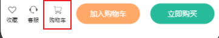
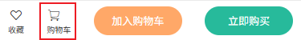
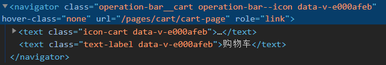
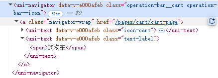
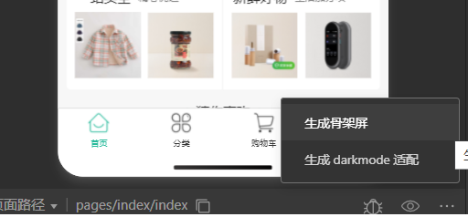
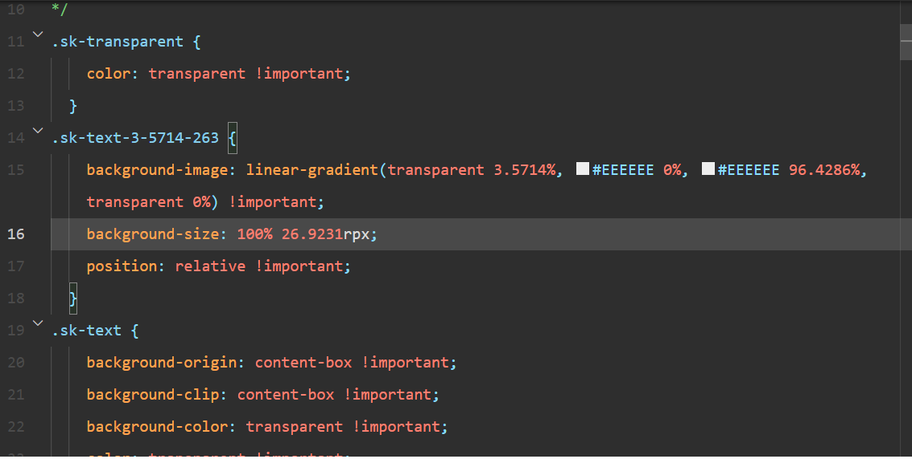
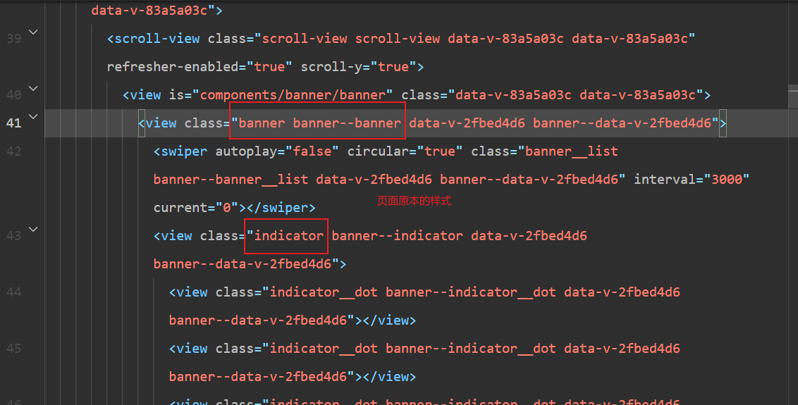
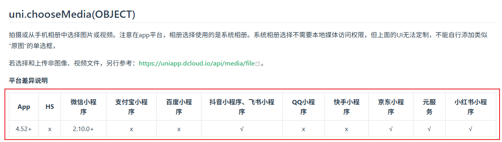

# 跨端兼容

## 引言

即使 uni-app 抹平了大部分设备之间的差距，但是依旧存在少数场景需要开发者手动兼容，这种兼容被叫做跨端兼容。

uni-app 跨端兼容主要面临以下几种场景：

- 组件
- 样式
- API

其实也非常好理解，以上几种场景刚好对应的就是前端三剑客（HTML，CSS，Javascript）。

想要学习跨端兼容，就要知道<u>为什么需要跨端兼容</u>，<u>它是为了解决什么问题</u>，以及<u>如何使用跨端兼容解决问题</u>

下面就让我们来深入探索每一种问题的表现以及解决这些问题的方法

## 一、组件

:::info 信息

在[uni-app 基本语言和开发规范](https://uniapp.dcloud.net.cn/tutorial/#%E5%9F%BA%E6%9C%AC%E8%AF%AD%E8%A8%80%E5%92%8C%E5%BC%80%E5%8F%91%E8%A7%84%E8%8C%83)中有提到，uni-app 的组件靠近微信小程序。

uni-app 中的 `view`、`text`、`navigator` 基本可以看作是微信小程序里面的同名组件

:::

在 uni-app 中的组件指的不仅仅是放在 `components` 目录下的组件，放在 `components` 下面的组件被称为**自定义组件**，而看起来不起眼的 `view`、`text`、`navigator` 其实也是组件，这些组件虽然经过编译之后和 `div`、`span`、`a` 没有太大差别，但是前者是组件，后者是浏览器中独有的 HTML 标签

需要兼容的组件主要是那些 uni-app 内置的基础组件，即 `view`、`text`、`navigator` 等组件，其他自定义组件或第三方组件库基本都是由这些基础组件实现，所以处理这些基础组件即可。

:::tip 补充

由于 uni-app 里面的组件靠近微信小程序，甚至可以说就是微信小程序，所以在微信开发者工具中预览看起来没什么问题，但是在 Web，App 端预览就会发现样式看起来和微信小程序不一样

:::

下面展示一个真实的需要兼容的示例：

```vue
<!-- 操作栏·购物车 -->
<template>
  <navigator
    hover-class="none"
    url="/pages/cart/cart-page"
    class="operation-bar__cart operation-bar--icon"
  >
    <text class="icon-cart"></text>
    <text class="text-label">购物车</text>
  </navigator>
</template>
```

这是一个简单的跳转导航，通过 `navigator` 实现，在微信小程序上显示正常，如下图所示：



而 web 端的 `navigator` 显示不正常，图标和文字没有居中显示，如下图所示：



看起来样式上有出现问题，分别查看两个设备上的 DOM 结构：





对比微信小程序上的 `navigator` ，web 上的结构多出了一层 `a` 标签，多出的一层标签让样式出现了问题，这就是为什么微信小程序显示正常而 web 显示不正常的原因。

知道了问题出现的原因，修复这个问题也不困难，只需要通过**条件编译**在 web 端对 `a.navigator-wrap` 的样式特殊处理即可：

```vue{4-11}
<style lang="scss" scope>
.operation-bar {
  &--icon {
    /* #ifdef WEB */
    :deep(.navigator-wrap) {
      display: flex;
      flex-flow: column nowrap;
      align-items: center;
      justify-content: center;
    }
    /* #endif */
  }
}
</style>
```

## 二、样式

:::info 信息

CSS 贴近 Web 端，但不是所有的 CSS 语法都支持，太新的语法不支持，比如 `grid` 布局就不兼容所有设备，所以在 uni-app 的相关文档中一般会推荐使用 `flex` 布局

:::

### 选择器

uni-app 并非支持所有的 CSS 选择器，比如 `*` 号选择器就不支持

[uni-app 选择器](https://uniapp.dcloud.net.cn/tutorial/syntax-css.html#%E9%80%89%E6%8B%A9%E5%99%A8)文档里面有列出目前 uni-app 支持的选择器。

在这里简单列举一下目前支持的 CSS 选择器：

| 选择器  | 备注                                    |
| ---------- | ----------------------------------------- |
| .class     | 微信小程序自定义组件中仅支持 class 选择器 |
| #id        |                                           |
| view       |                                           |
| view, text | 逗号选择器                           |
| ::after    | 仅 vue 页面生效                      |
| ::before   | 仅 vue 页面生效                      |

### 作用域

:::warning 注意

非 Web 端默认不启用 scoped；Web 端默认启用 scoped。

:::

样式作用域如果有学习过 vue 的开发者应该都知道，普通的 CSS 作用域是全局，只要在页面中引入，就会影响到全局，带来方便的同时也有可能导致同名样式冲突，样式修改牵一发而动全身。

而在 vue 单文件组件可以通过在 `style` 标签上添加 `scoped` 来启用样式作用域，从而避免上述问题。

:::tip 重点

**作用域兼容的点主要在非 Web 端默认不启用 scoped，而 Web 端则默认启用。**

前者作用于全局，后者作用于单文件组件，兼容方式可以查看[Vue 中的样式穿透](../../vue/extends/style-penetration)。

这里也简单列举一下 vue 中样式穿透的几种方式：

- vue2
  - `.test /deep/ span`
    - 支持 `css`、`less`
  - `.test >>> span`
    - 支持 `css`
  - `.test ::v-deep span`
    - 支持 `css`、`less`、`scss`
- vue3
  - `:deep(selector)`

:::

我一般会选择手动给 `style` 标签添加 `scoped` 从而在全部设备上启用样式作用域，这样可以在开发的过程中直接处理可能会遇到的样式作用域问题。

在开发过程中直接启用样式作用域，减少后期兼容工作，这是好处，但是这种方式也存在问题，<u>在某些需要共享样式但不需要全局样式的场景下会比较麻烦</u>，比如某些页面的骨架屏组件里的样式。

在 uni-app 项目的开发过程中，给页面配置骨架屏，一般会通过微信开发者工具的生成骨架屏工具来生成骨架屏组件，里面会用到一些原来页面的样式和骨架屏自身的样式，但是生成的 `.wxss` 不会附带原本页面样式。







图中生成的骨架屏结构有用到原本页面的样式，但是生成的骨架屏样式里面没有这些样式，如果说此时没有样式作用域，那显示上不会存在问题，因为原本页面的样式能够被骨架屏使用。

可如果手动给 `style` 标签添加 `scoped` 属性，就会导致骨架屏无法使用到原本页面的样式，就会导致骨架屏显示异常，面对这种情况，有 2 种选择：

1. 页面样式抽离到全局样式文件
2. 页面样式抽离到单独文件，页面和骨架屏组件手动导入抽离出去的文件

**全局样式文件固然方便，但同样会存在全局作用域的问题，所以一般会选择使用第 2 种方法，也就是抽离共享样式到单独的文件，然后在需要的地方手动导入。**

## 三、API

API 同样也有需要兼容的场景，在 uni-app 的 [API](https://uniapp.dcloud.net.cn/api/)文档中一般有列出 API 在各个终端中的兼容情况。



像图中显示 `chooseMedia` 在 App、微信小程序、抖音小程序、飞书小程序等支持，但是在 H5 中不支持，这种情况就需要选择其他适合的 API 或者在 H5 端隐藏对应功能的入口。

API 的适配也是通过条件编译：

```vue
<script lang="ts" setup>
// 选择头像
const onChooseAvatar = () => {
  // #ifdef MP-WEIXIN || APP || MP-LARK || MP-TOUTIAO || MP-JD || MP-XHS
  uni.chooseMedia({
    count: 1,
    mediaType: ["image"],
    camera: "front",
    success(res) {
      const { tempFilePath } = res.tempFiles[0];
      uploadAvatar(tempFilePath);
    },
  });
  // #endif
  // #ifdef WEB
  uni.chooseImage({
    count: 1,
    success(res) {
      const path = res.tempFilePaths[0];
      uploadAvatar(path);
    },
  });
  // #endif
};
</script>
```

## 总结

到此为止，我们讲解了**组件、样式及 API** 共 3 种需要兼容的场景，针对这篇文章，我们再整理总结一下：

:::details 为什么需要跨端兼容？

uni-app 抹平了大部分设备之间的差距，但是依旧存在少数场景需要在代码层面进行兼容

:::

:::details 跨端兼容是为了解决什么问题？

**组件、样式及 API** 共 3 种场景在不同平台上存在差异，遇到差异的时候需要进行兼容

:::

:::details 如何使用跨端兼容解决问题？

跨端兼容都是使用**条件编译**来实现不同平台使用不同代码

:::

最后说一点，开发过程中不需要特意去记哪些组件或者样式，API 存在兼容问题，开发过程中在一个平台上面预览，测试过程中需要上架的平台都仔细测试，**遇到问题的时候再去兼容即可**。

对于跨端兼容，uni-app 有专门整理一个文档，就是[uni-app 跨端注意](https://uniapp.dcloud.net.cn/matter.html)，如果要了解更多跨端的信息，可以查看这个文档
