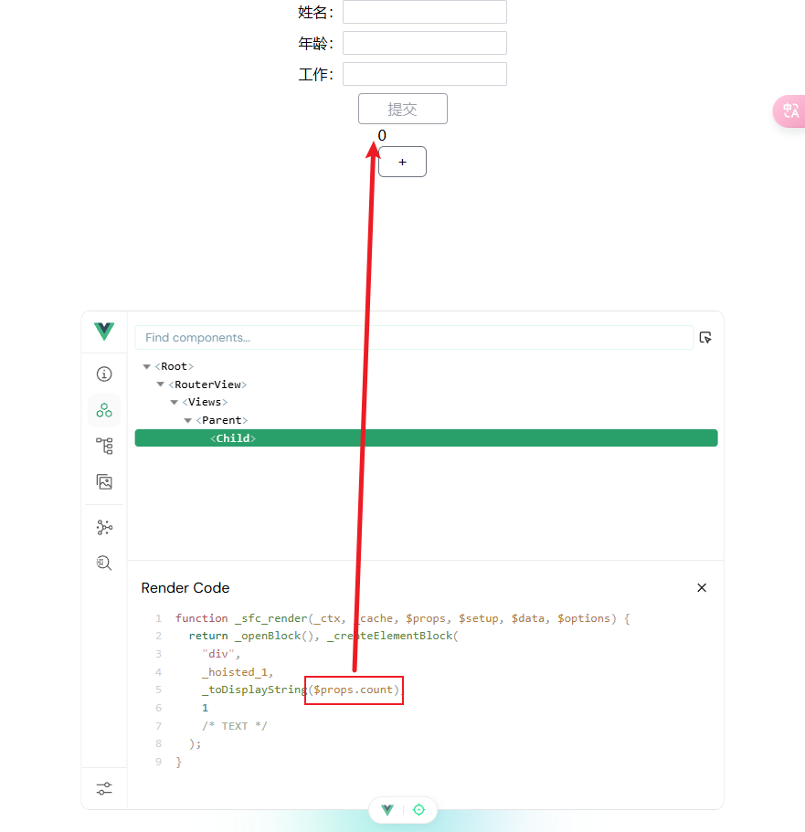
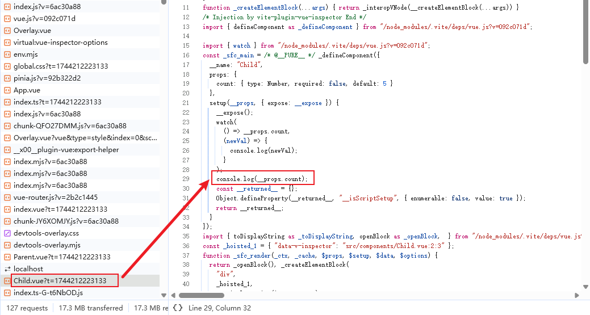

# Props

## 响应式 Props 解构 <Badge type='tip' text='3.5+' />

在 vue 3.5 之前，`props` 如果直接解构，得到的只会是**值**，而不是响应式变量，父组件绑定到子组件上的变量发生变化，子组件里面解构出来的值不会同步

后面出现了 `toRefs` 和 `toRef` 工具函数，可以辅助我们从 `props` 中解构出响应式数据，具体代码如下所示：

:::code-group

```vue [Parent.vue]
<template>
  <div>
    <Child :count="count"></Child>
    <button @click="++count">+</button>
  </div>
</template>
<script setup lang="ts">
const count = ref(0);
</script>
```

```vue{8} [Child.vue]
<template>
  <div>{{ count }}</div>
</template>
<script setup lang="ts">
const props = defineProps<{
  count: number;
}>();
const { count } = toRefs(props)
</script>
```

:::

从 3.5 开始， `props` 可以直接解构并同时保存响应式特性，具体代码如下：

```vue
<template>
  <div>{{ count }}</div>
</template>
<script setup lang="ts">
const props = defineProps<{ // [!code --]
  count: number; // [!code --]
}>(); // [!code --]
const { count } = toRefs(props) // [!code --]

const { count = 0 } = defineProps<{  // [!code ++]
  count?: number;  // [!code ++]
}>();  // [!code ++]
</script>
```

:::warning 注意

需要注意的是，直接解构得出的 `prop` 在 `template` 中具有响应式，但是在 `script` 中是不具备响应式特性的





从上面 2 张图片可以看出：**解构出来的 `prop` 实际上最后会从 `$props` 中获取，不同的是在 `template` 会有响应式特性，而 `script` 中没有**

:::
