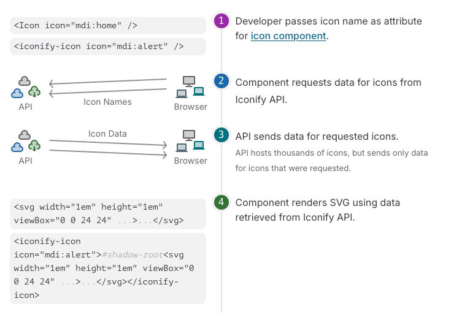

# iconify

:::info
[iconify](https://iconify.design/) 是一个和 `icon` 有关的第三方库，它集成了许多开源的 icon 集合，在项目开发的过程中可以简单方便地使用这个库内的图标。
:::

:::tip
[icones](https://icones.js.org/) 是一个替代 iconify 浏览图标的网站，由 antfu 创建，相对 iconify 原有的页面更加好看，浏览图标更加方便
:::

## 如何使用 iconify

使用 iconify 有好几种方法，它可以通过 css 使用，也可以通过内嵌 svg 的方式使用，还可以通过 iconify 内置的组件来使用，每一种方法下面还有分好几种使用方法，具体的可以直接看 [官方文档](https://iconify.design/docs/usage/)，这里只整理出几种用的比较多的：

- 通过 iconify 自身的组件 `<iconify-icon>` 使用
- 通过 iconify 为各自框架准备的组件使用，比如 vue 场景下的 `<Icon />`
- 下载需要的 icon 集合，从里面导出指定图标直接使用

前面两种方法都是按需加载图标数据，在页面访问的时候从 iconify 提供的服务获取图标数据，然后再渲染，如下图所示：



但是这两种一般在生产环境难以应用，毕竟 iconify 提供服务有可能那天就挂了，这个时候你的网站不就加载不出图标了。

第 3 种方法就是比较适用于生产的，图标数据直接下载下来，打包的时候和页面放一起。

第 3 种方法使用起来也是比较困难的，需要以下几个步骤：

1. 找到图标对应的图标集名字
2. 下载图标集对应的 npm 包名字
3. 导入图标
4. 使用图标

不过社区已经给出了更方便的解决方案，利用 `unplugin-icons` 自动下载图标对应的图标集数据并进行编译，利用 `unplugin-vue-components` 自动导入对应的图标组件，这 2 个插件将 4 个步骤缩减成 1 个步骤，相当于我们直接使用图标就行。

下面我们看下如何配置这 2 个插件并使用图标：

- 下载 `unplugin-icons` 和 `unplugin-vue-components`

  ```sh
  pnpm add -D unplugin-icons unplugin-vue-components
  ```

- 配置 `vite.config.ts`

  ```ts [vite.config.ts]
  import IconsResolver from "unplugin-icons/resolver";
  import Icons from "unplugin-icons/vite";
  import Components from "unplugin-vue-components/vite";
  export default defineConfig(() => {
    const config = {
      plugins: [
        // ...
        Components({
          dts: "src/types/components.d.ts",
          resolvers: [
            IconsResolver({ // [!code focus]
              // 自动引入的Icon组件统一前缀，默认为icon，设置false为不需要前缀 // [!code focus]
              prefix: "Icon", // [!code focus]
            }), // [!code focus]
          ],
        }),
        Icons({ // [!code focus]
          compiler: "vue3", // 指定编译器 // [!code focus]
          autoInstall: true, // 自动安装 // [!code focus]
        }), // [!code focus]
        // ...
      ],
    };
    return config;
  });
  ```

- 使用图标

  ```vue
  <template>
    <n-icon size="40" color="#ff0000">
      <IconAntDesignMenuFoldOutlined /> <!-- [!code focus] -->
    </n-icon>
  </template>
  ```

  上面组件名称变成 `IconAntDesignMenuFoldOutlined` 是因为 `vite.config.ts` 设置了 `prefix: "Icon"` , 默认为 `i`。

更多使用 iconify 的方法请看下方列表：

- [Vue 3使用 Iconify 作为图标库与图标离线加载的方法、Icones 开源在线图标浏览库的使用](https://blog.csdn.net/u011843342/article/details/133947744)

- [如何在vue3+vite中优雅的使用iconify图标](https://blog.csdn.net/weixin_46872121/article/details/138212930)
