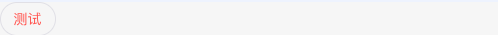
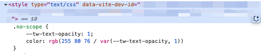
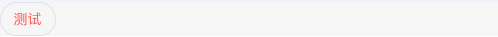
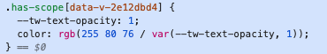
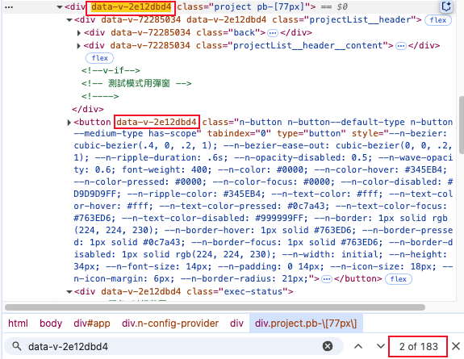
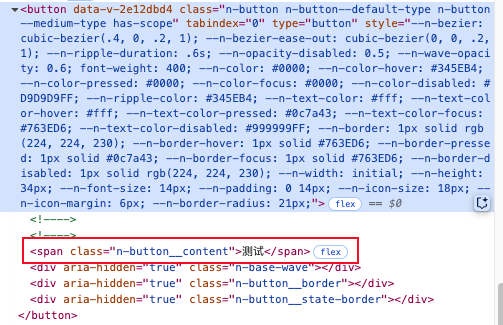
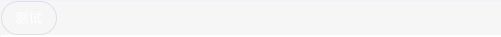
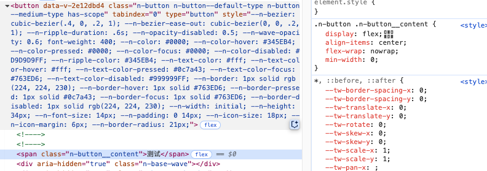
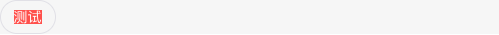
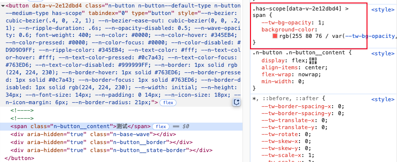

# Vue 中的样式穿透

在 vue 中有一个特殊的 css 问题：无法直接修改组件的样式，相信开发过的 vue 项目的人都遇到过这个问题，除非你选择将所有的样式都写在全局作用域下面，但即使如此相信你也曾听闻过这个问题。

对于这个问题，你肯定也知道如何解决它，那就是**样式穿透**，直接看代码：

<Badge type='info' text='vue3' /> 实现样式穿透

```vue{10-19}
<template>
  <n-button
    type="error"
    class="test"
  >
    这是一个测试用例
  </n-button>
</template>
<style scoped lang="scss">
// 写法不区分 css/scss/less
.test {
  :deep(span) {
    background-color: red;
  }
  // 另一种写法
  /*::v-deep(span){
    background-color: red;
  }*/
}
</style>
```

<Badge type='info' text='vue2' /> 实现样式穿透

```vue{10-18,21-26,29-33}
<template>
  <n-button
    type="error"
    class="test"
  >
    这是一个测试用例
  </n-button>
</template>
<style scoped>
/* .test /deep/ span {
  background-color: red;
} */
/* .test >>> span {
  background-color: red;
} */
/* .test ::v-deep span {
  background-color: red;
} */
</style>
<style scoped lang="less">
/* .test ::v-deep span {
  background-color: red;
} */
/* .test /deep/ span {
  background-color: red;
} */
</style>
<style scoped lang="scss">
.test {
  ::v-deep span {
    background-color: red;
  }
}
</style>
```

以上代码分别展示了 vue2 和 vue3 中如何使用样式穿透来修改组件中元素的样式。

在很多时候修改组件中元素样式首先会在组件上加一个 `class` 类名，然后先加一个样式，测试下能不能直接修改，如果不能就会知道这是样式作用域的问题，就会尝试样式穿透，一般用上样式穿透就能成功修改组件里面元素的样式，但有时候即使加上样式穿透也无法修改，这个时候就很让人抓狂，所以我就想要知道样式穿透的原理，还有样式穿透解决了什么问题，只有理解了**为什么**，我们才能更好地**做什么**，这样才能更好地掌握这个知识。

## 源头：样式作用域

### vue 中写样式的几种方法

1.直接在 SFC 单文件组件中写样式

```vue
<style lang="scss" scoped>
.n-form-item-blank {
  align-items: center;
  .n-select {
    display: flex;
    height: 20px;
    align-items: center;
  }
}
</style>
<style lang="scss">
.n-form-item-blank {
  align-items: center;
  .n-select {
    display: flex;
    height: 20px;
    align-items: center;
  }
}
</style>
```

2.在样式文件中写样式

```scss
.n-form-item-blank {
  align-items: center;
  .n-select {
    display: flex;
    height: 20px;
    align-items: center;
  }
}
```

在使用上，第2种方法，在单独的样式文件写样式适用于公共样式或全局样式，第1种方法，在页面组件或通用组件中编写样式适用于特定页面/组件，一般无法和其他页面共用。

在第1种方法中，有2种写法，区别只在是否添加 `scoped` ，这影响到里面的样式是否影响到全局，或者说样式是否有所谓的作用域，是全局的，还是只适用于当前组件的。

:::danger 不要在 `SFC` 里面写全局样式
一般不推荐在 `SFC` 中写全局样式，这会导致后期维护困难，就像你在 JS 中把变量全部挂载到 `window` 上面，这也许一定程度上提供了便利，但是会给后期维护带来更大的困难

**如果你真的需要写全局组件，为什么不直接在一个单独的样式文件中编写呢？**
:::

### 有样式作用域和没有样式作用域的区别

接下来，我们继续探索有无样式作用域对样式的影响。

#### 没有样式作用域下的样式

先来看看没有样式作用域，样式会如何：

:::code-group

```vue [page-1.vue]{4-8}
<template>
  <n-button class="no-scope">测试</n-button>
</template>
<style lang="scss">
.no-scope {
  @apply text-red-primary;
}
</style>
```

```vue [page-2.vue]
<template>
  <n-button class="no-scope">另一个页面</n-button>
</template>
```

:::




可以看到即使*page-2*没有写样式，但是样式也会受到 `.no-scope` 的影响，`.no-scope` 是全局的。

:::info
需要注意的是，如果要让 `.no-scope` 对*page-2*产生影响，需要先加载*page-1*。
:::

我们再从**css代码**的角度看看，



可以看到没有样式作用域的 css 样式其实和普通的 css 代码一样，只是加载的时间是在该组件加载的时候，如果组件没有加载那么就不会加载对应的 css 代码，并且加载完成后，即使组件销毁，也不会删除对应的 `<style>` 节点，样式依旧会生效。

#### 有样式作用域下的样式

再看看有样式作用域对样式的影响：

:::code-group

```vue [page-1.vue]{4-8}
<template>
  <n-button class="has-scope">测试</n-button>
</template>
<style scoped lang="scss">
.has-scope {
  @apply text-red-primary;
}
</style>
```

```vue [page-2.vue]
<template>
  <n-button class="has-scope">另一个页面</n-button>
</template>
```

:::




可以看到加上样式作用域后，其他页面已经不受到当前页面的样式影响，样式 `.has-scope` 无法在*page-2*页面生效

同样地，我们从**css代码**的角度看看，



可以看到，添加了 `scoped` 之后，css 代码和没有添加 `scoped` 的 css 代码差别不大，只是多了一个 `[data-v-2e12dbd4]`。

如果你有基础的 css 知识，你会知道这是一个[属性选择器](https://developer.mozilla.org/zh-CN/docs/Web/CSS/Attribute_selectors)。

看起来只是添加了一个属性选择器就实现了样式作用域，**但是为什么加了一个属性选择器就可以区分不同页面呢**，这是值得继续探究的。

:::details 小结
在继续探究之前，我们先对这一节得到的信息进行一个总结：

- 没有样式作用域下的样式和全局样式没有本质上区别，它能够在其他的组件中继续生效
- 有样式作用域的样式会在样式名后多出一个属性选择器
:::

### 样式作用域的实现原理

前面的小节，我们知道了样式作用域下的样式后面会携带一个属性选择器 `[data-v-2e12dbd4]`，通过类选择器+属性选择器实现样式作用域，让样式只能在当前组件发挥作用。

那为什么加上一个 `[data-v-2e12dbd4]` 就可以让样式只在当前组件发挥作用呢？

既然存在着这样一个 `[data-v-2e12dbd4]`，那么说明页面中的元素一定存在一个拥有 `[data-v-2e12dbd4]` 的元素，我们何不在页面上搜索一下，看看是不是存在着 `[data-v-2e12dbd4]` 的元素身上就有 `.has-scope`。



上图即是页面中搜索 `[data-v-2e12dbd4]` 得到的结果，从中我们得到 3 个结论：

1. `.has-scope` 元素身上存在 `[data-v-2e12dbd4]`，所以才能使 `.has-scope[data-v-2e12dbd4]` 生效
2. `[data-v-2e12dbd4]` 不止存在一个
3. 不仅存在 `[data-v-2e12dbd4]`，还存在 `data-v-72285034`，甚至出现两者同时出现在一个元素的情况

对于第 1 点结论，我们是可以预见的，如果`.has-scope` 元素身上不存在 `[data-v-2e12dbd4]`，那对应的样式怎么可能生效呢？

但是，第 2 点结论和第 3 点结论却又让人更加迷惑，为什么会有这么多的 `[data-v-2e12dbd4]` ？为什么会存在 `data-v-72285034` ？为什么 `[data-v-2e12dbd4]` 会和 `[data-v-72285034]` 出现在同一个元素上

这里直接说出结论：

- vue 编译的时候会给 SFC 中的普通 DOM 元素添加一个 `[data-v-xxxxxxxx]` 属性
- 对于组件，只会给最外层元素添加 `[data-v-xxxxxxxx]` 属性，同时组件自身也是一个 SFC ，也会在编译的时候添加一个属于自身的 `[data-v-xxxxxxxx]` 属性，这就解释了为什么一个元素身上存在 2 个 `[data-v-xxxxxxxx]` 属性

:::tip 注意
那些通过 `teleport` 将元素转移到其他地方的不会添加 `[data-v-xxxxxxxx]` 属性

[teleport](https://cn.vuejs.org/guide/built-ins/teleport.html#teleport)是一个内置组件，它可以将一个组件内部的一部分模板“传送”到该组件的 DOM 结构外层的位置去。
:::

## 终点：样式穿透

前面我们已经了解如何使用样式，也明白了样式作用域的实现原理，在开始探秘样式穿透之前，不妨再回顾一下前面的知识：

1. vue3 通过 `:deep(selector)` 实现样式穿透，也可以通过 `::v-deep(selector)`
2. vue2 根据 css/scss/less 选择不同的写法实现样式穿透
   1. css 通过 `/deep/`，`>>>`，`::v-deep` 实现
   2. less 通过 `/deep/`，`::v-deep` 实现
   3. scss 通过 `::v-deep` 实现
3. 通过 `selector[data-v-xxxxxxxx]` 实现样式作用域

回顾之前的知识，联想我们将要探究的样式穿透，大胆地猜想一下，样式穿透是否也是在 `selector[data-v-xxxxxxxx]` 上做文章

### 样式穿透的作用

之前我们已经知道在样式作用域下，类名后面会添加一个 `[data-v-xxxxxxxx]`，就像下面代码所示

```scss{1}
.has-scope[data-v-2e12dbd4] {
  --tw-text-opacity: 1;
  color: rgb(255 80 76 / var(--tw-text-opacity, 1));
}
```

在这样的样式下，*page-1*页面内拥有这个样式的元素都会被修改文字颜色，如下图所示，


但这并不是样式穿透，只是添加到组件根元素的样式。为了探究样式穿透，我们将按钮文字的背景颜色改成红色：



要修改 `button` 下面的 `span` 的背景颜色，修改代码如下：

```vue
<template>
  <n-button class="has-scope">
    测试
  </n-button>
</template>
<style scoped lang="scss">
.has-scope {
  & > span {
    @apply bg-red-primary;
  }
}
</style>
```

页面展示如下：



我们再看看页面上 `span` 元素是否有对应的样式：



全局查找 `.has-scope` ，得到如下代码：

```css{1}
.has-scope > span[data-v-2e12dbd4] {
  --tw-bg-opacity: 1;
  background-color: rgb(255 80 76 / var(--tw-bg-opacity, 1));
}
```

对以上信息整理可以得到 2 点结论：

1. 样式作用域会在选择器的尾部添加上 `[data-v-xxxxxxxx]`
2. `button` 下面的 `span` 属于 `<n-button>` 组件内的元素，没有 `[data-v-xxxxxxxx]` ，所以无法命中 `.has-scope > span[data-v-2e12dbd4]`

#### 如果添加了样式穿透

看过了没有添加样式穿透的代码，知道为什么无法直接修改组件中的元素样式，我们再对比下添加了样式穿透的效果。

修改代码如下：

```vue
<template>
  <n-button class="has-scope">
    测试
  </n-button>
</template>
<style scoped lang="scss">
.has-scope {
  & > :deep(span) {
    @apply bg-red-primary;
  }
}
</style>
```

页面效果及代码：





```css{1}
.has-scope[data-v-2e12dbd4] >  span {
  --tw-bg-opacity: 1;
  background-color: rgb(255 80 76 / var(--tw-bg-opacity, 1));
}
```

可以看到添加了样式穿透之后，页面成功改动，样式也能命中目标元素了

对比添加样式前后的代码，可以看到样式穿透所做的只是将 `[data-v-xxxxxxxx]` 提前一个元素，放到上一个选择器尾部。

:::tip
如果没有上一个选择器，`[data-v-xxxxxxxx]` 会充当上一个选择器

```vue{2}
<style scoped lang="scss">
:deep(.has-scope) {
  @apply bg-red-primary;
}
</style>
```

在页面上会呈现如下代码：

```css{1}
[data-v-2e12dbd4] .has-scope {
  --tw-bg-opacity: 1;
  background-color: rgb(255 80 76 / var(--tw-bg-opacity, 1));
}
```

:::

### 如何才能更好地使用样式穿透

经过上面的探究，相信大家已经掌握样式作用域及样式穿透的秘密，在修改组件内部元素的样式时不再简单粗暴地使用样式穿透，最后发现添加了样式穿透也无法成功修改。遇到这种情况，大家也可以从代码层面进行排查

对于如何更好使用样式穿透，我有以下几条建议：

1. 确认样式所在 SFC 的 `[data-v-xxxxxxxx]`
2. 确认要修改元素是组件根元素还是组件内的其他元素
