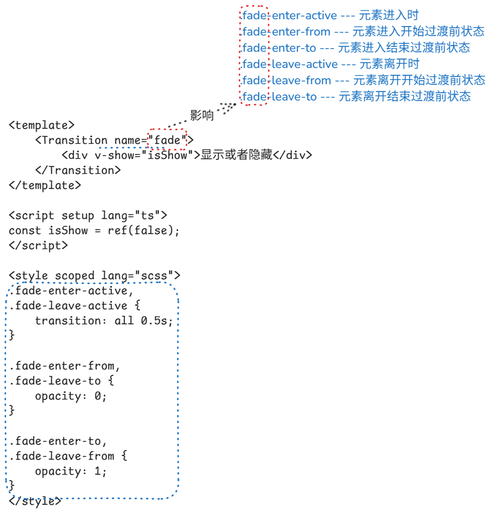

# transition 过渡效果

[Transition | Vue.js](https://cn.vuejs.org/guide/built-ins/transition.html)

这里的 transition 指的不是 css 中的 transition 属性，而是 vue 封装过的过渡效果组件。

vue 针对元素的添加/删除/移动，封装了 2 个组件：`<Transition>`、`<TransitionGroup>`。前者用于对单个元素添加过渡效果，后者用于对多个元素添加过渡效果。

## Transition

### 基础使用



如上图所示，使用 `<Transition>` 需要经历以下几个步骤：

- 使用 `<Transition>` 包裹目标元素
- 定义 `<Transition>` 所需的样式
  - `.fade-enter-active`
  - `.fade-enter-from`
  - `.fade-enter-to`
  - `.fade-leave-active`
  - `.fade-leave-from`
  - `.fade-leave-to`
- 给 `<Transition>` 的 `name` 属性赋值
  - 如果没有给 `name` 赋值，默认为 `v`。也就是说上面的 `.fade-enter-active` 会变成 `.v-enter-active`

:::details 能够触发 transition 的操作

- `v-if/v-else/v-else-if`
- `v-show`
- 元素的 `key` 值变化
  - 相同标签通过 `key` 区分为不同的元素
- `component` 组件 `is`
  - 动态组件

:::

### 拓展

#### 使用 animation 实现过渡效果

除了通过 `transition` 实现元素的过渡，还能够通过 `animation` 实现。

```vue
<template>
  <Transition name="fade">
    <div v-show="isShow">显示或者隐藏</div>
  </Transition>
</template>

<script setup lang="ts">
const isShow = ref(false);
</script>

<style scoped lang="scss">
.fade-enter-active {  // [!code focus]
  animation: fade-in 0.5s;  // [!code focus]
}  // [!code focus]
.fade-leave-active {  // [!code focus]
  animation: fade-in 0.5s reverse;  // [!code focus]
}  // [!code focus]
.fade-in {  // [!code focus]
  0% {  // [!code focus]
    opacity: 0;  // [!code focus]
  }  // [!code focus]
  50% {  // [!code focus]
    opacity: 0.5;  // [!code focus]
  }  // [!code focus]
  100% {  // [!code focus]
    opacity: 1;  // [!code focus]
  }  // [!code focus]
}  // [!code focus]
</style>
```

#### “Transition 样式生命周期”

下图是源自 vue 官网的一张图，用于表示过渡过程中 class 的添加顺序，也可以说是过渡效果的生命周期


#### 元素间过渡

```vue
<template>
  <Transition name="fade">
    <div v-if="mode === 'edit'" @click="changeMode('create')">edit</div>  <!-- [!code focus] -->
    <div v-if="mode === 'create'" @click="changeMode('delete')">create</div>  <!-- [!code focus] -->
    <div v-if="mode === 'delete'" @click="changeMode('edit')">delete</div>  <!-- [!code focus] -->
  </Transition>
</template>

<script setup lang="ts">
const mode = ref<"edit" | "create" | "delete">("edit");
const changeMode = (str: "edit" | "create" | "delete") => {
  mode.value = str;
}
</script>
```

像上面这种就是元素间过渡，需要注意的是，**`<Transition>` 里面的元素至始至终只能有 1 个**

#### 过渡模式

对于上面的*元素间过渡*，会出现一个问题：某些时刻会同时出现 2 个元素，比如上面例子中同时出现 `edit` 和 `create`。这是因为默认会先让 `create` 进入，再让 `edit` 退出。

要修复这个问题，只需要在 `<Transition>` 上指定 `mode` 为 `out-in` 即可。

```vue
<template>
  <Transition name="fade" mode="out-in"> <!-- [!code focus] -->
    <div v-if="mode === 'edit'" @click="changeMode('create')">edit</div>
    <div v-if="mode === 'create'" @click="changeMode('delete')">create</div>
    <div v-if="mode === 'delete'" @click="changeMode('edit')">delete</div>
  </Transition>
</template>
```

#### 通过 key 实现过渡

对于同类标签，可以通过添加 `key` 来实现过渡，而不一定需要通过 `v-if` 或 `v-show` 来实现。

比如 [上面的例子](./transition#元素间过渡) ，可以修改成这样：

```vue
<template>
  <Transition name="fade">
    <div v-if="mode === 'edit'" @click="changeMode('create')">edit</div>  <!-- [!code --] -->
    <div v-if="mode === 'create'" @click="changeMode('delete')">create</div>  <!-- [!code --] -->
    <div v-if="mode === 'delete'" @click="changeMode('edit')">delete</div>  <!-- [!code --] -->
    <div :key="mode">{{ mode }}</div> <!-- [!code ++] -->
  </Transition>
</template>
```

#### 更多

除了上面对 `<Transition>` 的基本使用，还有如何通过 `animation` 实现过渡，还有以下内容可以深入 `<Transition>` 的使用

- [JavaScript 钩子](https://cn.vuejs.org/guide/built-ins/transition.html#javascript-hooks)
  - `<Transition>` 内置过渡生命周期钩子函数结合 [AnimeJS](https://animejs.com/) / [GSAP](https://gsap.com/) 实现更加强大的过渡
- [自定义过渡 class](https://cn.vuejs.org/guide/built-ins/transition.html#custom-transition-classes)
  - 自定义过渡的 class，不依靠 `.**-enter-active`、`.**-leave-active` 这些内置的样式实现过渡
  - 配合 [Animate.css](https://animate.style/) 实现过渡

## TransitionGroup

`<TransitionGroup>` 和 `<Transition>` 的用法差不多，区别如下：

| 对比项目                 | TransitionGroup | Transition |
|----------------------|:---------------:|-----------:|
| 目标对象                 |    多个元素     |   单个元素 |
| 过渡模式是否可用         |     不可用      |       可用 |
| 目标对象是否需要唯一 key |      需要       |     不需要 |
| 过渡元素添加位置         |   列表内元素    |   容器元素 |

### 基本使用

以下是一个基本使用的例子

<iframe src="https://stackblitz.com/edit/vitejs-vite-aed6gijp?ctl=1&embed=1&file=src%2FApp.vue&hideExplorer=1&view=preview"></iframe>

值得注意的是 ，`<TransitionGroup>` 需要给 `.xx-move` 添加过渡，给 `.xx-leave-active` 设置绝对定位，否则元素在位置变化的时候会没有过渡效果：

```vue {6,18-22}
<style scoped>
.container {
  width: 100%;
  overflow: hidden;
}
.list-move, /* 对移动中的元素应用的过渡 */
.list-enter-active,
.list-leave-active {
  transition: all 0.5s ease;
}

.list-enter-from,
.list-leave-to {
  opacity: 0;
  transform: translateX(30px);
}

/* 确保将离开的元素从布局流中删除
  以便能够正确地计算移动的动画。 */
.list-leave-active {
  position: absolute;
}
</style>
```
