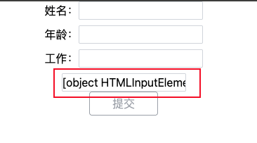

# vue 通过 ref 获取到组件实例遇到的问题

在 vue 中会通过给组件 / `DOM` 元素添加 `ref` 属性并声明同名响应式数据变量来获取组件实例 / `DOM` 元素引用，像这样：

```vue
<template>
  <input ref="inputRef" />
</template>

<script setup lang="ts">
const inputRef = ref();
</script>
```

上面就是通过 `ref` 获取到组件实例的代码，看起来没有什么难处，但是有时候比较粗心，会将 `ref` 的值写成一个响应式数据，比如这样：

```vue
<template>
  <input v-model="nameInput" ref="nameInput" />
</template>

<script setup lang="ts">
const nameInput = ref("");
</script>
```

这时候就会发现 `input` 输入框**默认有值，并且光标聚焦到输入框的时候无法输入内容**，如下图所示：



这种错误不常见，在浏览器控制台中也没有抛出错误，排查也不好排查，只能平常自己小心点，遵循以下几点规则能够有效防止出现这种错误：

- 避免使用同名变量
- 避免使用和组件名一样的变量名
  - 特别是项目中使用了 `unplugin-vue-components` 这类插件，如果声明了同名的变量会很容易出错

:::details 拓展

`Vue 3.5` 版本开始提供 `useTemplateRef` ，便于获取模板中的组件实例和 `DOM` 引用。点击查看[详情](https://cn.vuejs.org/api/composition-api-helpers.html#usetemplateref)

:::
